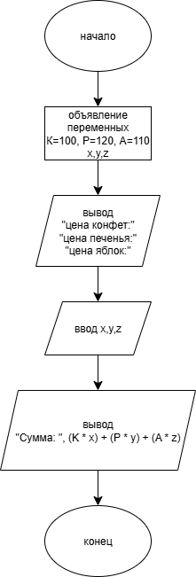
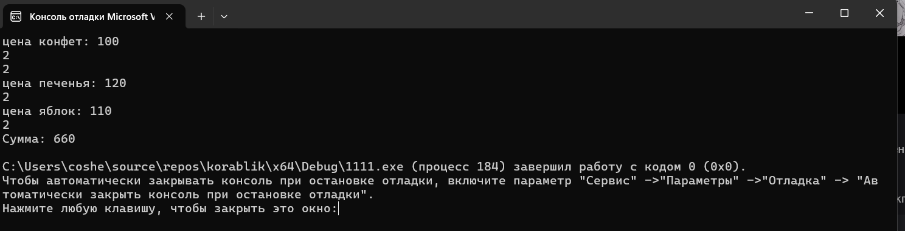

# Домашняя работа к лабораторной работе 2.
## Условия задачи:
Известна стоимость 1 кг конфет, печенья и яблок. Найти стоимость всей покупки, если купили Х кг конфет, Y кг печенья и Z кг яблок.
## 1. Алгоритм и блок схема:
### Алгоритм:
1. **Начало**
2. Задать исходные данные:
   - `К` = 100 (рублей) стоимость 1 кг.конфет
   - `Р` = 120 (рублей) стоимость 1 кг.печенья
   - `А` = 110(рублей) стоимость 1 кг.яблок
   - `x,y,z` = количесвто купленных кг.
3. Вычислить сумму всей покупки:
   - (`K` * `x`) + (`P` * `y`) + (`A` * `z`)
4. Вывести результаты расчётов с подстановкой значений в текст.
5. **Конец**

### Блок схема

## 2. Реализация программы:

		#include <stdio.h>
		#include <locale.h>
		int main()
		{
			float s;
			
			setlocale(LC_ALL, "RUS");
			int K = 100;
			int P = 120;
			int A = 110;
			int x, y, z;

			printf("цена конфет: %d\n", K);
			scanf_s("%d\n", &x);
			printf("цена печенья: %d\n", P);
			scanf_s("%d\n", &y);
			printf("цена яблок: %d\n", A);
			scanf_s("%d\n", &z);
			printf("Сумма: %d\n", (K * x) + (P * y) + (A * z));
		}
## 3. Результат работы программы

## 4. Информация о разработчике
Амелина Юлия, бИПТ-252

